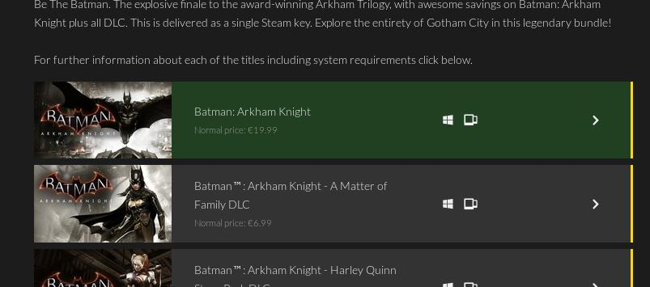

# FanaticalUtilities
Tampermonkey script that give the user a bit more information about bundles

## How to install

1. You need to install Tampermonkey in [Firefox](https://addons.mozilla.org/es/firefox/addon/tampermonkey/) or [Chrome](https://chrome.google.com/webstore/detail/tampermonkey/dhdgffkkebhmkfjojejmpbldmpobfkfo)
2. Go to the [raw version of the script](https://github.com/MrMarble/FanaticalUtilities/raw/master/FanaticalUtilities.user.js) and it should prompt the installation window directly.

##  Usage
The script is only executed in the bundle section of fanatical, the url looks  like this: `https://www.fanatical.com/<langugage>/bundle/<Game bundle>`

When the script is executed for the first time, a popup will appear asking for an steam api key and your steam id: 

If you want to change the parameters, in the bottom right corner a cog icon will appear to let you show the same popup 

## What it does
This script  will add a yellow border and a icon to the games that have steam trading cards, it also can change the background to green if you already own that game (this is optional if you leave the steam-id property empty)

